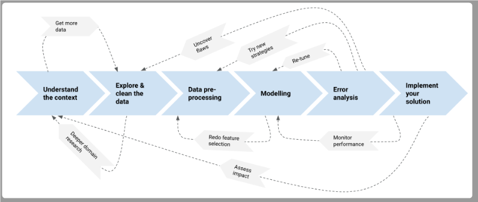
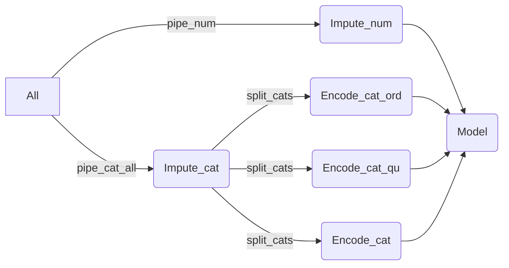

# ML_SupClass
exploring various supervised ML algo for classification

## Steps for Modeling

------------
### 1. Understand the context.
often means doing **domain research**.

In this case,
 from the general principles (what are traditionally the known main drivers of housing prices?) 
 to the specific characteristics of our task (what does the real state market look like in Iowa?)
 and even more concrete aspects of our dataset (what are the different types of roof materials? are some of them considered better than others?).

-------------
### 2. Explore & clean the data.
discover **features that do not make sense**, or that will not be available the moment you need to use the model for new predictions, 
detecting **inconsistencies** and, in general, determining if the data can be trusted (data quality). 
Cleaning : transforming the data so that it is digestible by your tools (e.g. dealing **with data types**)

----------
### 3. Split Data
**Split the data** to train and test data.

----------
### 4. Create accuracy baseline
If you can use your intuition to create a very simple rule that has score of 70% .
you can first try Logistic Regression Algo as first simple step in ML ex 75%
then, complex Machine Learning solution considered a good one if it scores at least 80%.

you should only see the training set to build the simple rule. 
Then, check how well your rule is by using it to make predictions on the test set.

### 5 Setup pipeline
**prepare the pipeline**
Note : K-Fold Cross Validation.usually between 5 and 10

---------
### 4. Data pre-processing.
Replacing **missing values** with an appropriate imputation strategy, 
**scaling** the data, 
**selecting/excluding or engineering features**.
This step usually has a much bigger impact in the performance of the model compared with the next step.

--------
### 5. Modelling
means finding its **parameters**.
training a model can take from some milliseconds to several days
Comparing different models with each other (“**model selection**”) can also be automated to some degree.
Note : variance biased Tradefoff

---------
### 6. Error analysis.
Machine Learning predictions are **never 100% accurate**
if they are, you might want to double check whether you made a mistake somewhere. “All models are wrong, but some are useful“.
For example: if you were classifying images of tumours between benign or malignant, you want to see how many of your errors are false positives (you predicted malignant, it was really benign) or false negatives (you predicted benign, it was malignant), because those errors have very different implications. 
This stage is crucial for determining the extent to which you can use the model in practice.

Note: cross validation: way to determinate which samples shall be used for traing and which for testing

---------------
### 7. Implement your solution.
#### a. reporting
Writing a report is typically the outcome of a “one-shot” analysis, where Machine Learning has been used to gain knowledge about a topic (e.g. studying which features that are the most important for determining the price of a house). 
#### b. deployment
 making the model available for “live” predictions. 
 This might mean to create an API that can take requests (input data) and provides responses (predictions). 
 Most of the time, software engineers will take care of model deployment, but Data Scientists might be involved in the monitoring of the results.

 ## General Note:
 why is it so important to understand the ins and outs of each algorithm, all the way down to the deepest mathematical foundations? 
 Well the truth is, the advantages to possessing this knowledge are marginal, the same way knowing thermodynamics and mechanical engineering is only a tiny advantage when it comes to driving a car. 
 So, do not obsess about it this early stage of your Machine Learning path, and do not fall into the gate-keeping of some Data Science snobs.

focus on understanding the intuition behind the main models and some of its parameters. 
When learning about them by reading its documentation or external tutorials, 
being able to answer some of the questions below can make a slight difference when it comes to interpreting the results, finding the optimal solution in a smaller number of iterations, uncovering a better pre-processing strategy:

 - Which are the main parameters of this model, and which ones just define slightly different implementations of the same algorithm? (some algorithms were firstly formulated decades ago, and now have more efficient implementations: there are parameters that just ask you which implementation to use)
 - For each parameter: if I increase or decrease its value, do I make the model more complex (able to fit more complex patterns) or more simple (able to generalize better)?
 - Does this model care about feature scaling?
 - Does it matter whether or not I include “bad features” into the training data?
 
One of your tasks, moving further, is going to be to learn about new algorithms, tune their parameters and answer those questions about them.

## Using SearchVC

### CV value
choose a value that is related to the number of samples .. 
Ideally between 5 and 10
samples High --> CV high 

### GridSearchCV vs RandomizedSearchCV
- Incase you have a 
    - very big DS
    - many parameters to optimize
    - or simply don't know which range to search for the best parameters
you can try first RandomizedSearchCV with big ranges 
Take the bestparam and run GridSearchCV with more narrow ranges 

